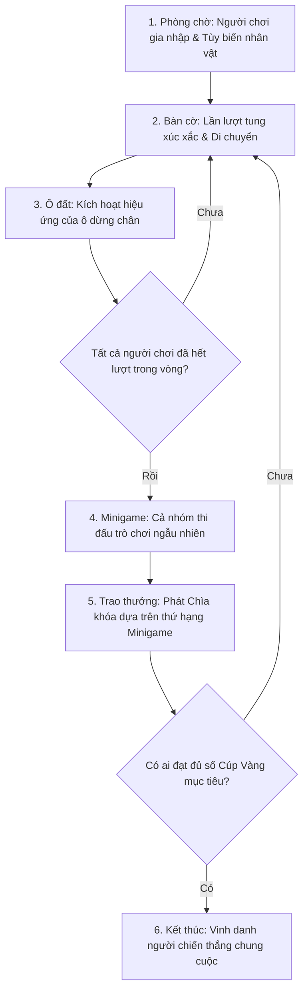

# TÀI LIỆU THIẾT KẾ GAME (GAME DESIGN DOCUMENT)
## DỰ ÁN: DICE PARTY (BẢN PHÁC THẢO THIẾT KẾ)

---

## 🎮 1. TẦM NHÌN TRÒ CHƠI (GAME VISION)

### 1.1. Giới thiệu dự án
**Dice Party** là một trò chơi cờ bàn (Board Game) kết hợp minigame hành động vui nhộn dành cho 2-4 người chơi cục bộ (Local Multiplayer). Trò chơi hướng tới việc tạo ra những khoảnh khắc gắn kết, tiếng cười và sự cạnh tranh kịch tính giữa nhóm bạn bè hoặc gia đình trong các buổi tụ họp.

### 1.2. Trụ cột Thiết kế (Design Pillars)
1. **Gắn kết & Tương tác cao (Social Party):** Trò chơi được thiết kế xoay quanh việc chơi chung trên cùng một màn hình (Local Play). Mọi cơ chế từ di chuyển, sử dụng vật phẩm đến cạnh tranh trong minigame đều phải tối ưu cho sự tương tác trực tiếp giữa người chơi ngoài đời thực.
2. **Cơ hội lật kèo (Catch-up Mechanics):** Luôn có cơ hội cho người chơi đứng cuối bảng quay trở lại cuộc đua thông qua các ô bẫy của đối thủ, vị trí rương dịch chuyển ngẫu nhiên và lượng phần thưởng lớn từ minigame.
3. **Cá nhân hóa vui nhộn (Playful Customization):** Người chơi có thể tự do định hình cá tính nhân vật ngay từ phòng chờ thông qua hệ thống lắp ghép phụ kiện ngộ nghĩnh, tạo cảm giác gắn bó với nhân vật của mình.
4. **Dễ tiếp cận nhưng có chiều sâu (Easy to learn, Hard to master):** Cơ chế bàn cờ vô cùng đơn giản (tung xúc xắc và di chuyển), nhưng các minigame sẽ đòi hỏi phản xạ, kỹ năng và tư duy chiến thuật để giành chiến thắng.

---

## 🔄 2. VÒNG LẶP CỐT LÕI (CORE GAME LOOP)

Vòng lặp trò chơi được thiết kế theo trình tự tuần hoàn khép kín như sau:

---

## 🕹️ 3. CƠ CHẾ BÀN CỜ CHÍNH (BOARD MECHANICS)

Bản đồ bàn cờ đóng vai trò là xương sống kết nối tiến trình của trò chơi. Người chơi sẽ di chuyển trên các tuyến đường được định vị sẵn.

### 3.1. Cơ chế Di chuyển & Định hướng
* **Tung xúc xắc:** Vào đầu lượt, người chơi tung một viên xúc xắc ngẫu nhiên từ 1 đến 6 để quyết định số bước đi tối đa.
* **Tuyến đường di chuyển:** Nhân vật di chuyển trượt mượt mà dọc theo các đường ray dẫn lối (Splines). Điều này giúp bàn cờ trông trực quan, sinh động hơn thay vì chỉ dịch chuyển tức thời qua từng ô.
* **Lựa chọn ngã rẽ:** Khi người chơi đi đến các nút giao nhau (ngã rẽ) mà vẫn còn bước đi, trò chơi sẽ tạm dừng di chuyển và hiển thị các mũi tên định hướng. Người chơi sử dụng nút điều hướng để chọn con đường mình muốn rẽ, sau đó nhân vật tiếp tục chạy nốt số bước còn lại trên tuyến đường mới.

### 3.2. Hệ thống các Ô đất (Board Nodes)
Khi dừng chân tại ô đất cuối cùng của lượt đi, người chơi sẽ kích hoạt hiệu ứng đặc trưng của ô đó:

| Loại ô đất | Ý tưởng thiết kế & Hiệu ứng gameplay |
| :--- | :--- |
| **Ô Khởi hành (Home)** | Vị trí xuất phát ban đầu của tất cả người chơi. |
| **Ô Tài nguyên (Plus)** | Cộng thêm một lượng Chìa khóa (Key) cho người chơi. Chìa khóa là đơn vị tiền tệ dùng để mua Cúp. |
| **Ô Bẫy (Trap)** | Gây hại cho người chơi dừng chân: Trừ máu nhân vật hoặc phạt mất một lượng Chìa khóa hiện có. |
| **Ô Hồi phục (Heal)** | Phục hồi lại sinh lực (Health) cho người chơi (giới hạn tối đa 30 HP). Nếu người chơi bị hết sạch máu do ô bẫy, họ sẽ bị phạt mất toàn bộ chìa khóa và phải hồi sinh lại. |
| **Ô Rương Vàng (Gold Chest)**| Đây là đích đến quan trọng nhất. Khi dừng chân tại đây, nếu người chơi có đủ số Chìa khóa yêu cầu, họ có quyền đổi lấy 1 **Cúp Vàng (Cup)**. Khi có người mua được Cúp, rương vàng này sẽ đóng lại, bay lên và tái xuất hiện ngẫu nhiên tại một vị trí ô rương ẩn khác trên bản đồ để bắt đầu một vòng đua mới. |

### 3.3. Cơ chế Vật phẩm phá rối (Sabotage Items)
Để tăng tính cạnh tranh, người chơi có thể sở hữu các vật phẩm để sử dụng trước khi tung xúc xắc:
* **Vật phẩm tấn công (Ví dụ: Súng điện/Laser):** Người chơi có thể kích hoạt vật phẩm này để bắn một tia năng lượng thẳng dọc theo tuyến đường bàn cờ. Nếu tia năng lượng bắn trúng đối thủ đang đứng phía trước, đối thủ đó sẽ bị tổn hại (trừ máu/khóa hoặc bị khống chế lượt sau).

---

## 🧑‍🤝‍🧑 4. HỆ THỐNG PHÒNG CHỜ & TÙY BIẾN NHÂN VẬT

Phòng chờ (Lobby) là nơi thiết lập kết nối giữa những người chơi và cho phép họ cá nhân hóa nhân vật của mình trước khi bước vào cuộc chơi chính thức.

### 4.1. Gia nhập phòng chơi (Joining Process)
* Trò chơi hỗ trợ cơ chế cắm-và-chơi (Plug & Play). Bất kỳ ai nhấn nút bất kỳ trên bàn phím hoặc tay cầm đều được ghi nhận là một người chơi mới và chiếm một ô vị trí trong phòng chờ (tối đa 4 người).
* Giao diện phòng chờ hiển thị nhân vật 3D tương ứng đang đứng trên bục để người chơi quan sát trực quan các thay đổi.

### 4.2. Tùy biến nhân vật (Customization Options)
Người chơi có thể tùy biến các bộ phận sau của nhân vật:
1. **Kiểu tóc (Hair):** Lựa chọn các kiểu tóc hài hước khác nhau.
2. **Trang phục / Bộ phận cơ thể (Body parts):** Chọn các bộ đồ hoặc phụ kiện đính kèm trên người.
3. **Màu sắc cơ thể (Body Color):** Chọn màu sắc đại diện cho nhân vật.
   * *Luật cân bằng giao diện:* Trò chơi áp dụng cơ chế **Khóa màu trùng**. Khi Người chơi A đã chọn màu đỏ, tùy chọn màu đỏ của những người chơi khác sẽ bị vô hiệu hóa để đảm bảo trong trận đấu không có hai nhân vật trùng màu nhau, giúp người chơi dễ dàng nhận biết bản thân trên bàn cờ và trong minigame hỗn loạn.
* Người chơi nhấn nút **Confirm** (Xác nhận) sau khi hoàn tất tùy chỉnh. Khi tất cả mọi người chơi trong phòng đã xác nhận sẵn sàng, trò chơi sẽ tự động đếm ngược để chuyển cảnh vào màn chơi chính.

---

## 🎯 5. HỆ THỐNG MINIGAME (MINIGAME SYSTEM)

Cuối mỗi vòng chơi, tất cả người chơi sẽ bị cuốn vào một chiều không gian minigame ngẫu nhiên. Đây là nơi kỹ năng cá nhân quyết định lượng Chìa khóa bạn mang về để mua Cúp Vàng.

### 5.1. Vòng đời của một Minigame (Minigame Flow)
* **Giai đoạn Hướng dẫn (Tutorial):** Trước khi chơi, một bảng thông tin hiển thị luật chơi, cách điều khiển và mục tiêu cần đạt được. Mọi người chơi phải nhấn nút Xác nhận (Ready) để chứng tỏ họ đã hiểu luật. Trò chơi chỉ bắt đầu khi tất cả mọi người sẵn sàng.
* **Giai đoạn Thi đấu (Gameplay):** Người chơi điều khiển nhân vật cạnh tranh trực tiếp. Một đồng hồ đếm ngược sẽ hiển thị thời gian còn lại của màn chơi.
* **Giai đoạn Tổng kết (Ranking & Reward):** Khi kết thúc màn chơi, trò chơi hiển thị bảng xếp hạng thành tích. Các nhân vật sẽ được xếp trên bục vinh quang từ cao xuống thấp. Người thắng cuộc sẽ thực hiện hoạt ảnh ăn mừng vui nhộn, người thua sẽ thực hiện hoạt ảnh buồn bã. Hệ thống sẽ phát chìa khóa thưởng theo thứ tự thứ hạng (ví dụ: Hạng nhất +8 khóa, Hạng nhì +6 khóa, Hạng ba +4 khóa, Hạng tư +2 khóa) trước khi đưa người chơi trở lại bản đồ chính.

### 5.2. Danh sách Ý tưởng Minigame dự kiến phát triển

Dưới đây là thiết kế chi tiết cho 10 minigame đầu tiên của trò chơi:

#### Minigame 1: Thu thập Xu (Coin Collector)
* **Mô tả:** Người chơi chạy tự do trong một đấu trường vuông để nhặt các đồng xu rơi từ trên trời xuống.
* **Chướng ngại vật:** Các khẩu đại bác đặt xung quanh rìa sân sẽ liên tục bắn các viên đạn lớn quét qua sân đấu. Người chơi bị đạn trúng sẽ bị choáng (Stun) và văng mất một số xu đang có.
* **Điều kiện thắng:** Người thu thập được nhiều xu nhất khi hết giờ sẽ xếp hạng cao nhất.

#### Minigame 2: Nhảy Né Lốp Xe (Tire Jump)
* **Mô tả:** Các người chơi đứng trên một đường băng dài chắn ngang.
* **Chướng ngại vật:** Các lốp xe khổng lồ lăn tới với tốc độ tăng dần từ cuối đường băng. Người chơi phải căn thời gian chuẩn xác để thực hiện cú nhảy vượt qua lốp xe.
* **Điều kiện thắng:** Người chơi bị lốp xe tông trúng sẽ bị loại khỏi vòng. Ai sinh tồn lâu nhất hoặc né được nhiều lốp xe nhất sẽ thắng.

#### Minigame 3: Đua Xe Ba Bánh (Tricycle Race)
* **Mô tả:** Cuộc đua tốc độ hài hước trên một đường chạy thẳng đứng bằng những chiếc xe đạp ba bánh trẻ con.
* **Cơ chế:** Người chơi phải liên tục nhấn phím hành động (Mash Button) để tạo lực đạp xe đi tới. Nhấn càng nhanh xe chạy càng nhanh, nhưng nhấn quá đà có thể khiến nhân vật bị mệt tạm thời.
* **Điều kiện thắng:** Ai cán đích đầu tiên sẽ chiến thắng.

#### Minigame 4: Hứng Ngô Rơi (Corn Catcher)
* **Mô tả:** Các nhân vật cầm giỏ chạy trên một sân đấu để hứng hạt ngô rơi từ trên trời xuống.
* **Cơ chế:** Có các loại ngô thường (cộng 1 điểm), ngô vàng lớn (cộng 3 điểm) và các loại quả thối/bom (trừ điểm hoặc gây choáng).
* **Điều kiện thắng:** Ai đạt điểm cao nhất sau khi hết thời gian đếm ngược sẽ thắng.

#### Minigame 5: Đấu Trường Va Chạm (Crash Arena)
* **Mô tả:** Đấu trường hình tròn không có tường chắn ở rìa.
* **Cơ chế:** Người chơi có khả năng lao mình (Dash) để tông vào người chơi khác. Mục tiêu là đẩy đối thủ trượt ra ngoài rìa đấu trường rơi xuống dưới.
* **Điều kiện thắng:** Người chơi sống sót cuối cùng trên võ đài hoặc đẩy được nhiều đối thủ nhất sẽ giành chiến thắng.

#### Minigame 6: Vòng Xoay Rửa Lửa (Fire Roller)
* **Mô tả:** Người chơi đứng trong một vòng tròn lớn.
* **Chướng ngại vật:** Một thanh chắn lửa dài ở giữa vòng tròn xoay quanh tâm với tốc độ biến thiên lúc nhanh lúc chậm. Người chơi cần nhảy qua hoặc cúi người xuống để né tránh thanh chắn lửa này.
* **Điều kiện thắng:** Người chơi bị lửa quét trúng sẽ bị loại. Người sống sót cuối cùng là người chiến thắng.

#### Minigame 7: Hộp Quà May Mắn (Gift Grabber)
* **Mô tả:** Sân đấu xuất hiện các hộp quà với kích cỡ và màu sắc khác nhau một cách ngẫu nhiên.
* **Cơ chế:** Người chơi chạy đến tương tác để mở quà. Quà càng to thời gian mở càng lâu nhưng chứa nhiều điểm hơn. Người chơi có thể đánh nhau để cướp lượt mở quà của đối thủ.
* **Điều kiện thắng:** Tổng số điểm từ quà cao nhất khi hết giờ.

#### Minigame 8: Băng Qua Đại Lộ (Street Crosser)
* **Mô tả:** Người chơi xuất phát ở một bên đường và phải di chuyển sang bên kia đường.
* **Chướng ngại vật:** Đường đi bao gồm nhiều làn xe chạy với tốc độ chóng mặt và đường ray xe lửa có còi báo hiệu tàu sắp chạy qua. Bước hụt hoặc bị xe tông trúng sẽ đưa người chơi về điểm xuất phát.
* **Điều kiện thắng:** Người đầu tiên băng qua đường thành công và chạm tay vào vạch đích.

#### Minigame 9: Quán Nhậu Hỗn Loạn (Pub Chaos)
* **Mô tả:** Bối cảnh là một quán bia/quán nhậu chật hẹp, trơn trượt.
* **Cơ chế:** Người chơi phải di chuyển bưng bê các khay bia/đồ ăn từ quầy phục vụ tới các bàn yêu cầu mà không bị trượt ngã bởi các vũng nước đổ trên sàn hoặc các khách hàng say xỉn đang loạng choạng đi lại.
* **Điều kiện thắng:** Phục vụ được nhiều bàn nhất trong thời gian quy định.

#### Minigame 10: Cầu Kính Sinh Tồn (Glass Bridge)
* **Mô tả:** Các người chơi đứng trước một cây cầu dài làm bằng các cặp ô kính đặt song song nhau.
* **Cơ chế:** Trong mỗi cặp kính, có một ô làm bằng kính cường lực (an toàn) và một ô làm bằng kính thường (sẽ vỡ vụn ngay khi dẫm lên khiến nhân vật rơi xuống vực). Người chơi phải chọn ô kính để bước. Nếu người đi trước bước sai và rơi xuống, những người đi sau phải ghi nhớ ô an toàn đó để đi tiếp.
* **Điều kiện thắng:** Người băng qua cầu kính sang bờ bên kia thành công sớm nhất.

---

## 🎨 6. ĐỊNH HƯỚNG MỸ THUẬT, GIAO DIỆN & ÂM THANH (ART & AUDIO)

### 6.1. Định hướng Mỹ thuật (Art Direction)
* **Phong cách:** 3D Low-poly hoặc Stylized tươi sáng, sặc sỡ. Nhân vật có tỉ lệ ngộ nghĩnh (đầu to, thân nhỏ, chuyển động lò cò, vụng về) để tăng tính hài hước.
* **Hiệu ứng hình ảnh:** Sử dụng các hiệu ứng ánh sáng rực rỡ, hạt bụi phát sáng (particles) khi xúc xắc lăn, khi rương vàng mở ra, và hoạt ảnh cháy nổ vui nhộn trong các minigame để kích thích thị giác.

### 6.2. Thiết kế Giao diện (UI/UX)
* **Trực quan & Tối giản:** Hạn chế các bảng chữ viết phức tạp. Sử dụng các biểu tượng (Icon) lớn cho Chìa khóa, Máu (Trái tim), Cúp Vàng (Ngôi sao/Cúp).
* **Hiệu ứng chuyển động giao diện (Motion UI):** Các nút bấm đổi màu gradient mềm mại khi tương tác. Các bảng thông tin bay ra hoặc thu phóng nhẹ nhàng khi xuất hiện, tạo cảm giác mượt mà và phản hồi tốt.
* **Camera năng động:** Sử dụng camera Cinemachine tự động theo dõi người chơi đang thực hiện lượt đi trên bản đồ hoặc tự động chia đôi màn hình / thu phóng góc rộng để bao quát toàn bộ người chơi trong các minigame.

### 6.3. Âm thanh (Audio)
* **Nhạc nền (BGM):** Nhạc điệu vui tươi, nhịp độ nhanh và tạo cảm giác lễ hội (Festive/Carnival) trên bàn cờ. Chuyển sang tiết tấu dồn dập, căng thẳng hơn khi bước vào minigame.
* **Hiệu ứng âm thanh (SFX):** Tiếng xúc xắc lăn lốc cốc, tiếng rương vàng mở giòn giã, tiếng nổ, tiếng kêu cứu hài hước của nhân vật khi trúng bẫy hay rơi xuống vực.

---

*Tài liệu này đóng vai trò là bản phác thảo thiết kế ý tưởng gốc trước khi bắt tay vào lập trình trò chơi Dice Party.*
